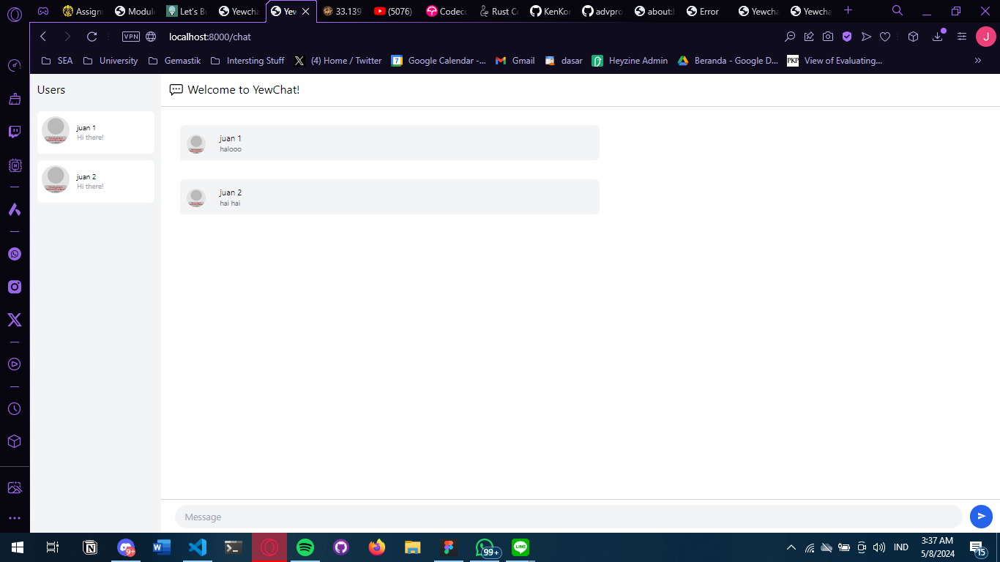
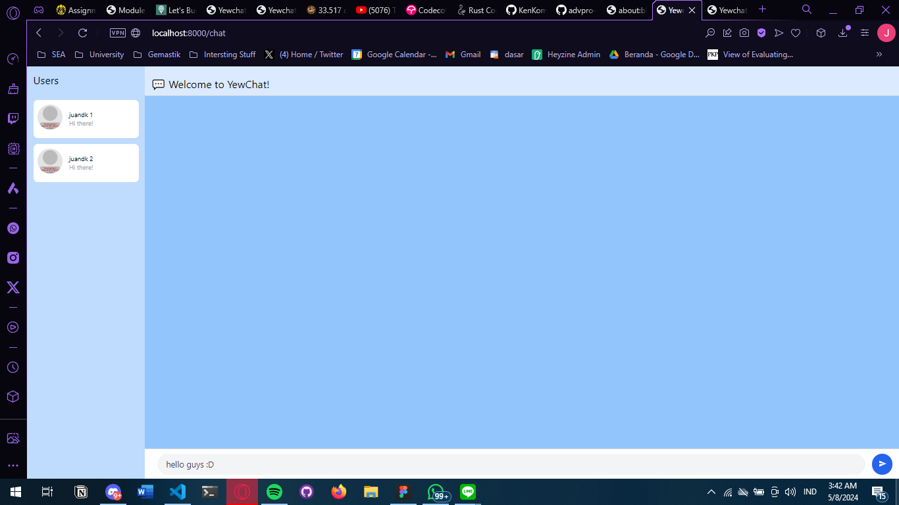
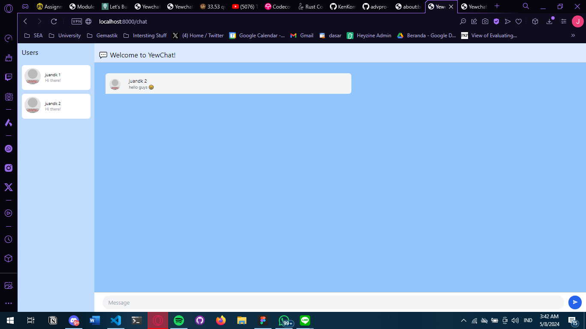
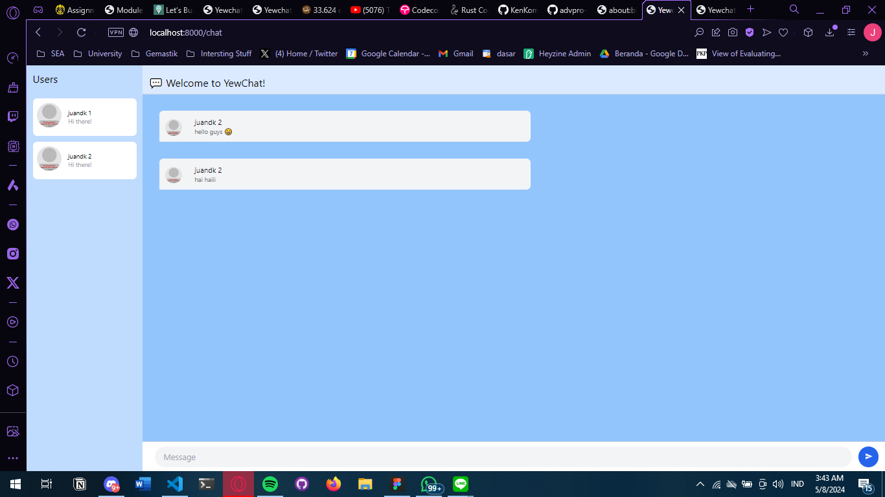

After cloning https://github.com/jtordgeman/YewChat/tree/websockets-part2 and https://github.com/jtordgeman/SimpleWebsocketServer repositories and after following the tutorials from this week's module I have built a chat app using websocket. Here are some of the interactions on this applications. Users can register with their username then chat in a public room with other users.

Here are some modifications I've made to the app, I've added a new sky blue color scheme, and added a feature that auto formats ":D" strings into "😁" emoji.